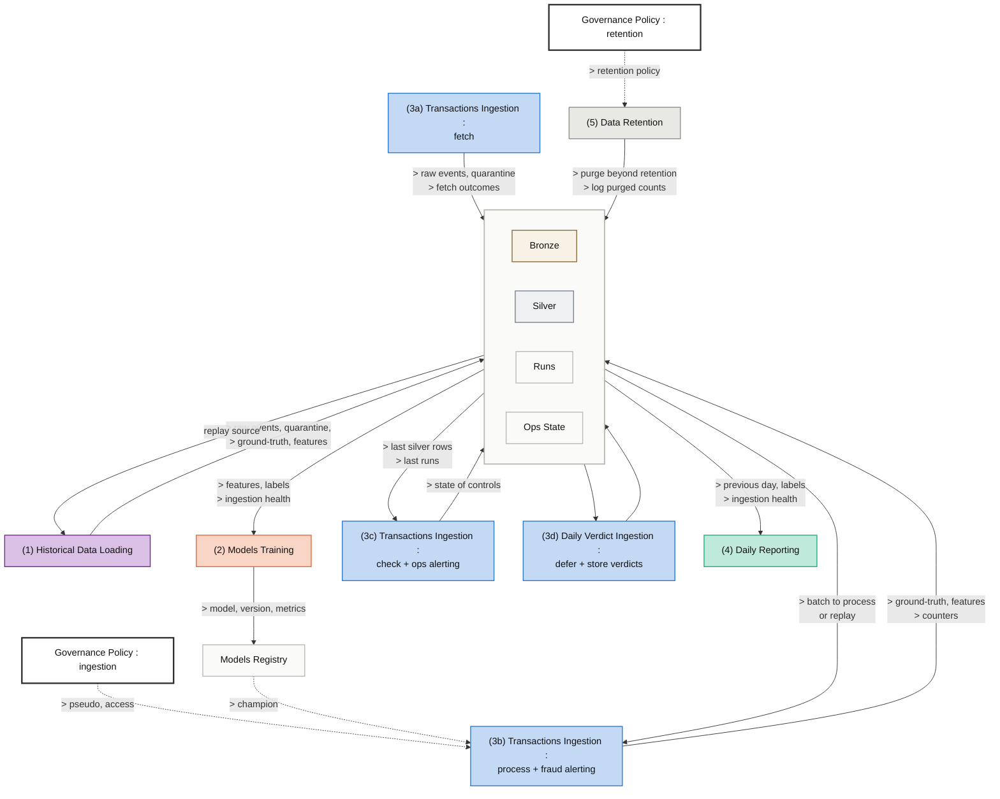

```mermaid
flowchart TD
	S0_HDL["(1) Historical Data Loading"]	
	
	subgraph S0_DL[" "]
		direction LR
		S0_DL_BRONZE["Bronze"]
		S0_DL_SILVER["Silver"]
		S0_DL_RUNS["Runs"]
		S0_DL_OPS["Ops State"]
	end	
	
	S0_MT["(2) Models Training"]
	S0_MR["Models Registry"]

	S0_GP_ING["Governance Policy : ingestion"]
	S0_G1_FCH["(3a) Transactions Ingestion :<br/>fetch"]  
	S0_G1_PRC["(3b) Transactions Ingestion :<br/>process + fraud alerting"] 
	S0_G1_CHK["(3c) Transactions Ingestion :<br/>check + ops alerting"] 
	S0_G1_LBL["(3d) Daily Verdict Ingestion :<br/>defer + store verdicts"] 
	
	S0_G2["(4) Daily Reporting"]
	
	S0_GP_RTN["Governance Policy : retention"]
	S0_RTN["(5) Data Retention"] 
	
	%% ----------
	
    S0_HDL  -->|"&gt; raw events, quarantine,<br/>&gt; ground-truth, features"| S0_DL
    S0_DL -->|"replay source"| S0_HDL
    
    S0_DL -->|"&gt; features, labels<br/>&gt; ingestion health"| S0_MT
    S0_MT -->|"&gt; model, version, metrics"| S0_MR
    
    S0_GP_ING -.->|"&gt; pseudo, access"| S0_G1_PRC

	S0_G1_FCH -->|"&gt; raw events, quarantine<br/>&gt; fetch outcomes"| S0_DL
    S0_G1_PRC -->|"&gt; ground-truth, features<br/>&gt; counters"| S0_DL
	S0_DL -->|"&gt; batch to process<br/>or replay"| S0_G1_PRC
    S0_DL -->|"&gt; last silver rows<br/>&gt; last runs"| S0_G1_CHK
    S0_MR  -.->|"&gt; champion"| S0_G1_PRC
    
    S0_DL -->|"&gt; previous day, labels<br/>&gt; ingestion health"| S0_G2
    
    S0_GP_RTN -.->|"&gt; retention policy"| S0_RTN
    S0_RTN -->|"&gt; purge beyond retention<br/>&gt; log purged counts"| S0_DL 
   
    S0_G1_CHK -->|"> state of controls"| S0_DL
    S0_DL --> S0_G1_LBL
    S0_G1_LBL --> S0_DL
    
    %% ---------- Group colours (pale wash) ----------
    style S0_DL   fill:#fafaf9,stroke:#b9b9b2,stroke-width:2px
    %% ---    
    classDef nBRONZE fill:#f7f1e6,stroke:#8a6a3c,stroke-width:1.5px,color:#111111
	class S0_DL_BRONZE nBRONZE
    classDef nSILVER fill:#eef0f2,stroke:#78808a,stroke-width:1.5px,color:#111111
	class S0_DL_SILVER nSILVER
    classDef nMETA   fill:#fafaf9,stroke:#b9b9b2,stroke-width:1.5px,color:#111111
	class S0_DL_RUNS,S0_DL_OPS,S0_MR nMETA
    %% ---
    classDef nHDL   fill:#dac0e5,stroke:#7b1fa2,stroke-width:1.5px,color:#111111
	class S0_HDL nHDL
    classDef nMT    fill:#f9d5c6,stroke:#eb6834,stroke-width:1.5px,color:#111111
    class S0_MT nMT
    classDef nG1    fill:#c3d9f4,stroke:#2a78d6,stroke-width:1.5px,color:#111111
    class S0_G1_FCH,S0_G1_PRC,S0_G1_CHK,S0_G1_LBL nG1
    classDef nGP    fill:#ffffff,stroke:#2b2b2b,stroke-width:2.5px,color:#111111
    class S0_GP_ING,S0_GP_RTN nGP
    classDef nG2    fill:#bfe9da,stroke:#1baf7a,stroke-width:1.5px,color:#111111
    class S0_G2 nG2
    classDef nRTN fill:#e8e8e5,stroke:#8d8d86,stroke-width:1.5px,color:#111111
    class S0_RTN nRTN
```