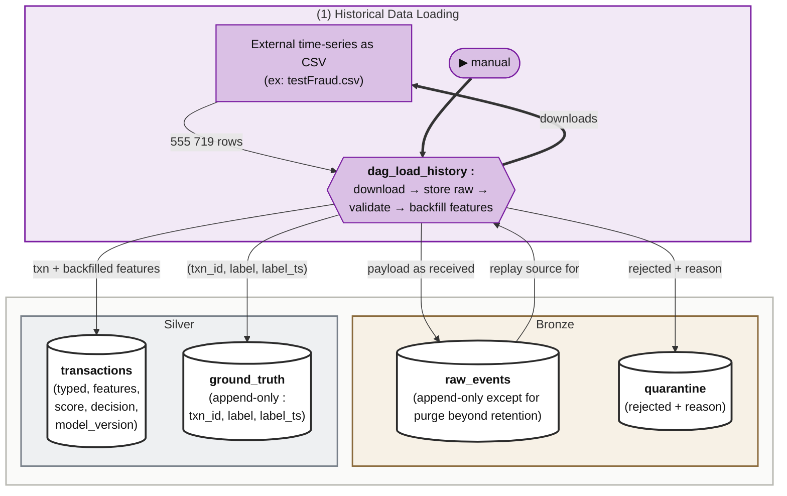

```mermaid
flowchart TD
	subgraph HDL["(1) Historical Data Loading"]
		HDL_CSV["External time-series as CSV<br/>(ex: testFraud.csv)"]
		HDL_T0(["▶ manual"])
		HDL_LOAD{{"<b>dag_load_history :</b><br/>download &rarr; store raw &rarr; <br/>validate &rarr; backfill features"}}		    
	end		
	
	subgraph DL[" "]
		subgraph DL_BRONZE["Bronze"]
			DL_RAW[("<b>raw_events</b><br/>(append-only except for purge beyond retention)")]
			DL_QRT[("<b>quarantine</b><br/>(rejected + reason)")]
		end
		subgraph DL_SILVER["Silver"]
			DL_TXN[("<b>transactions</b><br/>(typed, features,<br/>score, decision,<br/>model_version)")]
			DL_GTS[("<b>ground_truth</b><br/>(append-only :<br/>txn_id, label, label_ts)")]
		end
	end
	
    %% ---
    
    %% ---------- Data flow ----------
    HDL_CSV  -->|"555 719 rows"| HDL_LOAD
    DL_RAW  -->|"replay source for"| HDL_LOAD
    HDL_LOAD -->|"payload as received"| DL_RAW
    HDL_LOAD -->|"rejected + reason"| DL_QRT
    HDL_LOAD -->|"txn + backfilled features"| DL_TXN
    HDL_LOAD -->|"(txn_id, label, label_ts)"| DL_GTS
    
    %% ---------- Control flow ----------
    HDL_LOAD ==>|"downloads"| HDL_CSV
    HDL_T0 ==> HDL_LOAD
    
    %% ---------- Group colours (pale wash) ----------
    style HDL  fill:#f2e9f6,stroke:#7b1fa2,stroke-width:2px
    style DL   fill:#fafaf9,stroke:#b9b9b2,stroke-width:2px
    style DL_BRONZE fill:#f7f1e6,stroke:#8a6a3c,stroke-width:2px
    style DL_SILVER fill:#eef0f2,stroke:#78808a,stroke-width:2px

    %% ---------- Nodes : same hue, more intense ----------
    classDef nHDL fill:#dac0e5,stroke:#7b1fa2,stroke-width:1.5px,color:#111111
    class HDL_T0,HDL_CSV,HDL_LOAD nHDL

    %% ---------- Shared stores : white, overriding the group colour ----------
    %% written and/or read by more than one pipeline
    classDef shared fill:#ffffff,stroke:#2b2b2b,stroke-width:2.5px,color:#111111
    class DL_RAW,DL_QRT,DL_GTS,DL_TXN shared
```