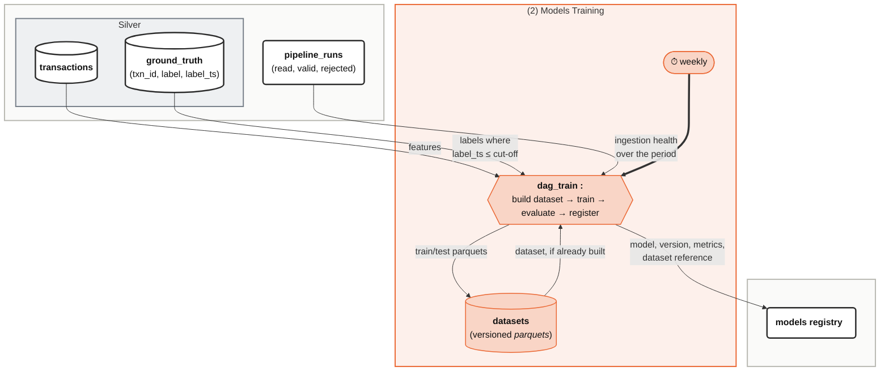

```mermaid
flowchart
	subgraph MT["(2) Models Training"]
		MT_T0(["⏱ weekly"])
		MT_TDS[("<b>datasets</b><br/>(versioned <i>parquets</i>)")]
		MT_TRN{{"<b>dag_train :</b><br/>build dataset &rarr; train &rarr; evaluate &rarr; register"}}  
	end
	
	subgraph DL[" "]
		direction LR
		subgraph DL_SILVER["Silver"]
			DL_TXN[("<b>transactions</b>")]
			DL_GTS[("<b>ground_truth</b><br/>(txn_id, label, label_ts)")]
		end		
		DL_RUNS("<b>pipeline_runs</b><br/>(read, valid, rejected)") 
	end
	subgraph MR[" "]
	    MR_MR("<b>models registry&nbsp;&nbsp;</b>")  
	end

    %% ---
    
    %% ---------- Data flow ----------
    DL_TXN  -->|"features"| MT_TRN
    DL_GTS  -->|"labels where<br/>label_ts &le; cut-off"| MT_TRN
    MT_TRN  -->|"train/test parquets"| MT_TDS
    MT_TRN  -->|"model, version, metrics,<br/>dataset reference"| MR_MR
    MT_TDS  -->|"dataset, if already built"| MT_TRN
    DL_RUNS -->|"ingestion health<br/>over the period"| MT_TRN 
    
    %% ---------- Control flow ----------
    MT_T0 ==> MT_TRN
	
    %% ---------- Group colours (pale wash) ----------
    style MR   fill:#fafaf9,stroke:#b9b9b2,stroke-width:2px
    style MT     fill:#fdf0eb,stroke:#eb6834,stroke-width:2px
    style DL   fill:#fafaf9,stroke:#b9b9b2,stroke-width:2px
    style DL_SILVER    fill:#eef0f2,stroke:#78808a,stroke-width:2px
    
    %% ---------- Nodes : same hue, more intense ----------
    classDef nMT  fill:#f9d5c6,stroke:#eb6834,stroke-width:1.5px,color:#111111
    %% simulation scaffolding : dashed border, absent from a real deployment
    class MT_T0,MT_TRN,MT_TDS nMT

    %% ---------- Shared stores : white, overriding the group colour ----------
    %% written and/or read by more than one pipeline
    classDef shared fill:#ffffff,stroke:#2b2b2b,stroke-width:2.5px,color:#111111
    class DL_GTS,DL_TXN,DL_RUNS,MR_MR shared
```