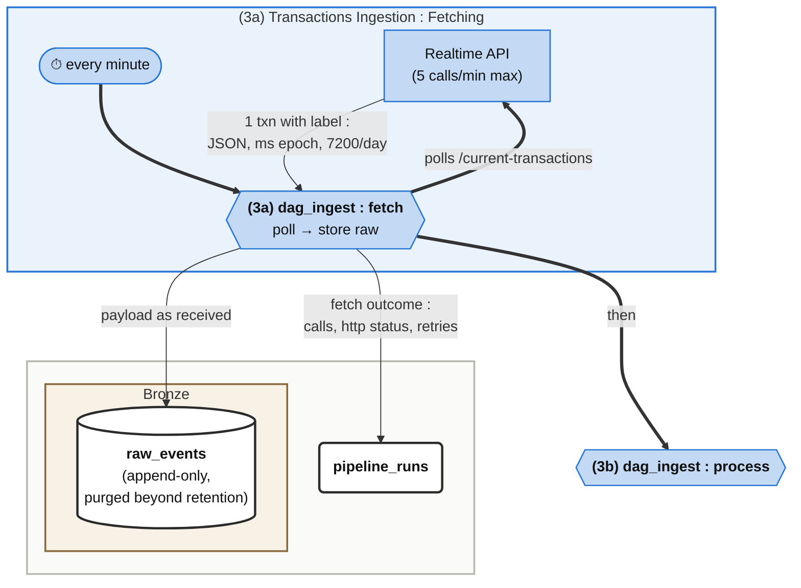

```mermaid
flowchart TD
	subgraph G1_FCH["(3a) Transactions Ingestion : Fetching"]
		G1_API["Realtime API<br/>(5 calls/min max)"]
		G1_T1(["⏱ every minute"])
		G1_ING_FCH{{"<b>(3a) dag_ingest : fetch</b><br/>poll &rarr; store raw"}}
	end

	subgraph DL[" "]
		subgraph DL_BRONZE["Bronze"]
			DL_RAW[("<b>raw_events</b><br/>(append-only,<br/>purged beyond retention)")]
		end
		DL_RUNS("<b>pipeline_runs</b>")
	end
	
	G1_ING_PRC{{"<b>(3b) dag_ingest : process</b>"}}
	
    %% ---
    
    G1_FCH ~~~ G1_ING_PRC
    
    %% ---------- Control flow ----------
    G1_T1 ==> G1_ING_FCH
    G1_ING_FCH ==>|"polls /current-transactions"| G1_API
	G1_ING_FCH ==>|"then"| G1_ING_PRC
	
    %% ---------- Data flow ----------
    G1_API  -->|"1 txn with label :<br/>JSON, ms epoch, 7200/day"| G1_ING_FCH
    G1_ING_FCH -->|"payload as received"| DL_RAW
    G1_ING_FCH -->|"fetch outcome :<br/>calls, http status, retries"| DL_RUNS
    
    %% ---------- Group colours (pale wash) ----------
    style DL   fill:#fafaf9,stroke:#b9b9b2,stroke-width:2px
    style DL_BRONZE  fill:#f7f1e6,stroke:#8a6a3c,stroke-width:2px
    style G1_FCH fill:#eaf2fb,stroke:#2a78d6,stroke-width:2px

    %% ---------- Nodes : same hue, more intense ----------
    classDef nG1  fill:#c3d9f4,stroke:#2a78d6,stroke-width:1.5px,color:#111111
    class G1_T1,G1_API,G1_ING_FCH,G1_ING_PRC nG1

    %% ---------- Shared stores : white, overriding the group colour ----------
    %% written and/or read by more than one pipeline
    classDef shared fill:#ffffff,stroke:#2b2b2b,stroke-width:2.5px,color:#111111
    class DL_RAW,DL_RUNS shared

```