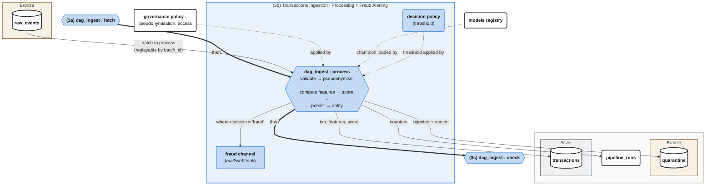

```mermaid
flowchart
	subgraph G1_PRC["(3b) Transactions Ingestion : Processing + Fraud Alerting"]
		G1_DP("<b>decision policy</b><br/>(threshold)")
		G1_ING_PRC{{"<b>dag_ingest : process</b><br/>validate &rarr; pseudonymise &rarr;<br/>compute features &rarr; score &rarr;<br/>persist &rarr; notify"}}
		G1_FRD["<b>fraud channel</b><br/>(<i>mail/webhook</i>)"]
	end  
	
	ING_FCH{{"<b>(3a) dag_ingest : fetch</b>"}}
	ING_CHK{{"<b>(3c) dag_ingest : check</b>"}} 

	subgraph BRONZE["Bronze"]
		BRZ_RAW[("<b>raw_events</b>")]
	end	
	
	subgraph ODL[" "]
		direction TB
		subgraph ODL_BRONZE["Bronze"]
			ODL_QRT[("<b>quarantine</b>")]
		end
		subgraph ODL_SILVER["Silver"]
			ODL_TXN[("<b>transactions</b>")]
		end
		ODL_RUNS("<b>pipeline_runs</b>")
	end

	GP_ING("<b>governance policy :</b><br/>pseudonymisation, access")	
	MR_MR("<b>models registry</b>")   

    %% ---

    %% ---------- Control flow ----------
	ING_FCH ==>|"then"| G1_ING_PRC
	G1_ING_PRC ==>|"then"| ING_CHK
	
    %% ---------- Data flow ----------
    BRZ_RAW  -->|"batch to process<br/>(replayable by batch_id)"| G1_ING_PRC
    G1_ING_PRC -->|"rejected + reason"| ODL_QRT
    G1_ING_PRC -->|"txn, features, score"| ODL_TXN
    G1_ING_PRC -->|"where decision = 'fraud'"| G1_FRD
    G1_ING_PRC -->|"counters"| ODL_RUNS
    
    %% ---------- Dependencies ----------
    GP_ING -.->|"applied by"| G1_ING_PRC
    MR_MR -.->|"champion loaded by"| G1_ING_PRC
    G1_DP -.->|"threshold applied by"| G1_ING_PRC
    
    %% ---------- Group colours (pale wash) ----------
    style ODL   fill:#fafaf9,stroke:#b9b9b2,stroke-width:2px
    style G1_PRC fill:#eaf2fb,stroke:#2a78d6,stroke-width:2px
    %% data layers : deliberately neutral, warm vs cool
    style BRONZE  fill:#f7f1e6,stroke:#8a6a3c,stroke-width:2px
    style ODL_BRONZE  fill:#f7f1e6,stroke:#8a6a3c,stroke-width:2px
    style ODL_SILVER  fill:#eef0f2,stroke:#78808a,stroke-width:2px

    %% ---------- Nodes : same hue, more intense ----------
    classDef nG1  fill:#c3d9f4,stroke:#2a78d6,stroke-width:1.5px,color:#111111
    class G1_T0,G1_API,G1_DP,ING_FCH,G1_ING_PRC,ING_CHK,G1_FRD nG1

    %% ---------- Shared stores : white, overriding the group colour ----------
    %% written and/or read by more than one pipeline
    classDef shared fill:#ffffff,stroke:#2b2b2b,stroke-width:2.5px,color:#111111
    class BRZ_RAW,ODL_QRT,SLR_GTS,ODL_TXN,ODL_RUNS,MR_MR,GP_ING shared

```