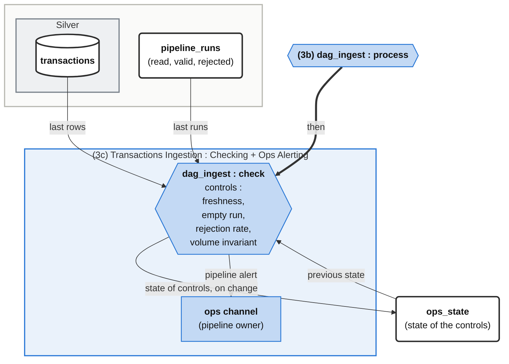

```mermaid
flowchart TD
	G1_ING_PRC{{"<b>(3b) dag_ingest : process</b>"}}
	
	subgraph G1_CHK["(3c) Transactions Ingestion : Checking + Ops Alerting"]
		G1_ING_CHK{{"<b>dag_ingest : check</b><br/>controls :<br/>freshness,<br/>empty run,<br/>rejection rate,<br/>volume invariant"}}
		G1_OPS["<b>ops channel</b><br/>(pipeline owner)"]
	end    
	    
	subgraph DL[" "]
		subgraph DL_SILVER["Silver"]
			DL_TXN[("<b>transactions</b>")]
		end		
		DL_RUNS("<b>pipeline_runs</b><br/>(read, valid, rejected)")
	end
	
	OPS("<b>ops_state</b><br/>(state of the controls)")
	
    %% ---
    G1_ING_PRC ~~~ G1_CHK
    
    %% ---------- Control flow ----------
	G1_ING_PRC ==>|"then"| G1_ING_CHK
	
    %% ---------- Data flow ----------
    DL_RUNS -->|"last runs"| G1_ING_CHK
    DL_TXN  -->|"last rows"| G1_ING_CHK
    OPS  -->|"previous state"| G1_ING_CHK
    G1_ING_CHK -->|"state of controls, on change"| OPS
    G1_ING_CHK  -->|"pipeline alert"| G1_OPS
    
    %% ---------- Group colours (pale wash) ----------
    style G1_CHK fill:#eaf2fb,stroke:#2a78d6,stroke-width:2px
    style DL   fill:#fafaf9,stroke:#b9b9b2,stroke-width:2px
    style DL_SILVER  fill:#eef0f2,stroke:#78808a,stroke-width:2px

    %% ---------- Nodes : same hue, more intense ----------
    classDef nG1  fill:#c3d9f4,stroke:#2a78d6,stroke-width:1.5px,color:#111111
    class G1_T1,G1_API,G1_ING_FCH,G1_ING_PRC,G1_ING_CHK,G1_OPS nG1
    %% simulation scaffolding : dashed border, absent from a real deployment
    classDef demo fill:#ffffff,stroke:#8a6a3c,stroke-width:1.5px,stroke-dasharray:4 3,color:#333333
    class DLY demo

    %% ---------- Shared stores : white, overriding the group colour ----------
    %% written and/or read by more than one pipeline
    classDef shared fill:#ffffff,stroke:#2b2b2b,stroke-width:2.5px,color:#111111
    class DL_TXN,DL_RUNS,OPS shared

```