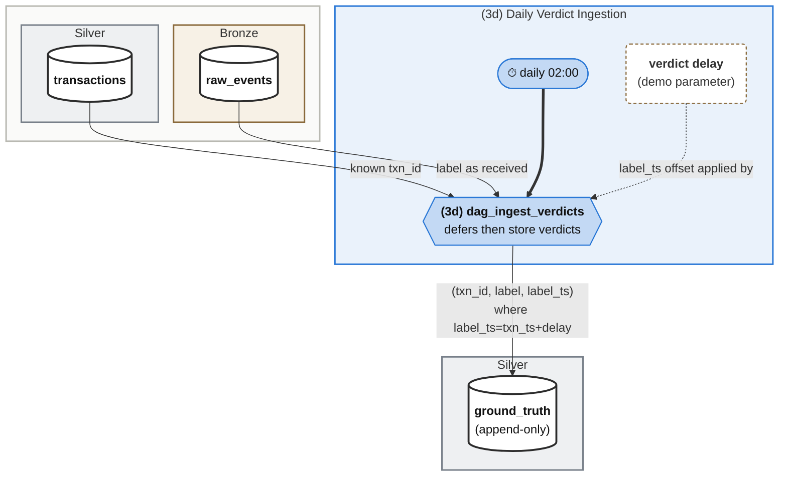

```mermaid
flowchart
	subgraph G1_LBL["(3d) Daily Verdict Ingestion"]
		G1_T1(["⏱ daily 02:00"])
		G1_DLY("<b>verdict delay</b><br/>(demo parameter)")
	    G1_ING_LBL{{"<b>(3d) dag_ingest_verdicts</b><br/>defers then store verdicts"}}
	end
	
	subgraph IDL[" "]
		subgraph IDL_BRONZE["Bronze"]
			IDL_RAW[("<b>raw_events</b>")]
		end
		subgraph IDL_SILVER["Silver"]
			IDL_TXN[("<b>transactions</b>")]
		end
	end

	subgraph SILVER["Silver"]
		SLR_GTS[("<b>ground_truth</b><br/>(append-only)")]
	end
	
    %% ---
	
    %% ---------- Control flow ----------
    G1_T1 ==> G1_ING_LBL
    
    %% ---------- Data flow ----------
    IDL_RAW  -->|"label as received"| G1_ING_LBL
    IDL_TXN  -->|"known txn_id"| G1_ING_LBL
    G1_ING_LBL  -->|"(txn_id, label, label_ts)<br/>where label_ts=txn_ts+delay"| SLR_GTS
    
    %% ---------- Dependencies ----------
    G1_DLY -.->|"label_ts offset applied by"| G1_ING_LBL
    
    %% ---------- Group colours (pale wash) ----------
    style IDL   fill:#fafaf9,stroke:#b9b9b2,stroke-width:2px
    style G1_LBL fill:#eaf2fb,stroke:#2a78d6,stroke-width:2px
    %% data layers : deliberately neutral, warm vs cool
    style SILVER  fill:#eef0f2,stroke:#78808a,stroke-width:2px
    style IDL_SILVER  fill:#eef0f2,stroke:#78808a,stroke-width:2px
    style IDL_BRONZE  fill:#f7f1e6,stroke:#8a6a3c,stroke-width:2px

    %% ---------- Nodes : same hue, more intense ----------
    classDef nG1  fill:#c3d9f4,stroke:#2a78d6,stroke-width:1.5px,color:#111111
    class G1_T1,G1_ING_LBL nG1
    classDef demo fill:#ffffff,stroke:#8a6a3c,stroke-width:1.5px,stroke-dasharray:4 3,color:#333333
    class G1_DLY demo

    %% ---------- Shared stores : white, overriding the group colour ----------
    %% written and/or read by more than one pipeline
    classDef shared fill:#ffffff,stroke:#2b2b2b,stroke-width:2.5px,color:#111111
    class IDL_RAW,DL_QRT,SLR_GTS,IDL_TXN,MR_MR,GP_ING shared

```