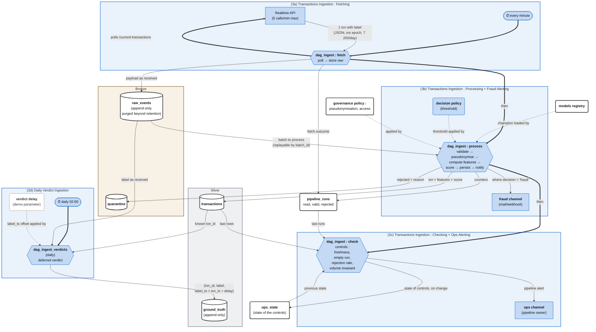

```mermaid
flowchart TD
	subgraph G1_FCH["(3a) Transactions Ingestion : Fetching"]
		G1_API["Realtime API<br/>(5 calls/min max)"]
		G1_T0(["⏱ every minute"])
		G1_ING_FCH{{"<b>dag_ingest : fetch</b><br/>poll &rarr; store raw"}}
	end
	
	subgraph G1_PRC["(3b) Transactions Ingestion : Processing + Fraud Alerting"]
		G1_DP("<b>decision policy</b><br/>(threshold)")
		G1_ING_PRC{{"<b>dag_ingest : process</b><br/>validate &rarr;<br/>pseudonymise &rarr;<br/>compute features &rarr;<br/>score &rarr; persist &rarr; notify"}}
		G1_FRD["<b>fraud channel</b><br/>(<i>mail/webhook</i>)"]
	end  
	
	subgraph G1_CHK["(3c) Transactions Ingestion : Checking + Ops Alerting"]
		G1_ING_CHK{{"<b>dag_ingest : check</b><br/>controls :<br/>freshness,<br/>empty run,<br/>rejection rate,<br/>volume invariant"}}
		G1_OPS["<b>ops channel</b><br/>(pipeline owner)"]
	end    
	    
	subgraph G1_LBL["(3d) Daily Verdict Ingestion"]
		G1_T1(["⏱ daily 02:00"])
		G1_DLY("<b>verdict delay</b><br/>(demo parameter)")
		G1_ING_LBL{{"<b>dag_ingest_verdicts</b><br/>(daily)<br/>deferred verdict"}}
	end

	subgraph BRONZE["Bronze"]
		BRZ_RAW[("<b>raw_events</b><br/>(append-only,<br/>purged beyond retention)")]
		BRZ_QRT[("<b>quarantine</b>")]
	end
	subgraph SILVER["Silver"]
		SLR_TXN[("<b>transactions</b>")]
		SLR_GTS[("<b>ground_truth</b><br/>(append-only)")]
	end
	
	RUNS("<b>pipeline_runs</b><br/>read, valid, rejected")
		
	OPS("<b>ops_state</b><br/>(state of the controls)")
	
	GP_ING("<b>governance policy :</b><br/>pseudonymisation, access")	
	MR_MR("<b>models registry</b>")   
	
    %% ---
    
    %% ---------- Control flow ----------
    G1_ING_FCH ==>|"polls /current-transactions"| G1_API
	G1_ING_FCH ==>|"then"| G1_ING_PRC
	G1_ING_PRC ==>|"then"| G1_ING_CHK
    G1_T0 ==> G1_ING_FCH
    G1_T1 ==> G1_ING_LBL
	
    %% ---------- Data flow ----------
    G1_API  -->|"1 txn with label<br/>(JSON, ms epoch, 7 200/day)"| G1_ING_FCH
    G1_ING_FCH -->|"payload as received"| BRZ_RAW
    BRZ_RAW  -->|"batch to process<br/>(replayable by batch_id)"| G1_ING_PRC
    G1_ING_PRC -->|"rejected + reason"| BRZ_QRT
    G1_ING_PRC -->|"txn + features + score"| SLR_TXN
    BRZ_RAW  -->|"label as received"| G1_ING_LBL
    SLR_TXN  -->|"known txn_id"| G1_ING_LBL
    G1_ING_LBL  -->|"(txn_id, label,<br/>label_ts = txn_ts + delay)"| SLR_GTS
    G1_ING_PRC -->|"where decision = 'fraud'"| G1_FRD
    G1_ING_PRC -->|"counters"| RUNS
    RUNS -->|"last runs"| G1_ING_CHK
    SLR_TXN  -->|"last rows"| G1_ING_CHK
    G1_ING_CHK  -->|"pipeline alert"| G1_OPS
    G1_ING_FCH -->|"fetch outcome"| RUNS
    OPS  -->|"previous state"| G1_ING_CHK
    G1_ING_CHK -->|"state of controls, on change"| OPS
    
    %% ---------- Dependencies ----------
    MR_MR -.->|"champion loaded by"| G1_ING_PRC
    G1_DP -.->|"threshold applied by"| G1_ING_PRC
    G1_DLY -.->|"label_ts offset applied by"| G1_ING_LBL
    GP_ING -.->|"applied by"| G1_ING_PRC
    
    %% ---------- Group colours (pale wash) ----------
    style G1_FCH fill:#eaf2fb,stroke:#2a78d6,stroke-width:2px
    style G1_PRC fill:#eaf2fb,stroke:#2a78d6,stroke-width:2px
    style G1_CHK fill:#eaf2fb,stroke:#2a78d6,stroke-width:2px
    style G1_LBL fill:#eaf2fb,stroke:#2a78d6,stroke-width:2px
    %% data layers : deliberately neutral, warm vs cool
    style BRONZE  fill:#f7f1e6,stroke:#8a6a3c,stroke-width:2px
    style SILVER  fill:#eef0f2,stroke:#78808a,stroke-width:2px

    %% ---------- Nodes : same hue, more intense ----------
    classDef nG1  fill:#c3d9f4,stroke:#2a78d6,stroke-width:1.5px,color:#111111
    class G1_T0,G1_T1,G1_API,G1_DP,G1_ING_FCH,G1_ING_PRC,G1_ING_CHK,G1_ING_LBL,G1_FRD,G1_OPS nG1
    %% simulation scaffolding : dashed border, absent from a real deployment
    classDef demo fill:#ffffff,stroke:#8a6a3c,stroke-width:1.5px,stroke-dasharray:4 3,color:#333333
    class G1_DLY demo

    %% ---------- Shared stores : white, overriding the group colour ----------
    %% written and/or read by more than one pipeline
    classDef shared fill:#ffffff,stroke:#2b2b2b,stroke-width:2.5px,color:#111111
    class BRZ_RAW,BRZ_QRT,SLR_GTS,SLR_TXN,RUNS,OPS,MR_MR,GP_ING shared

```