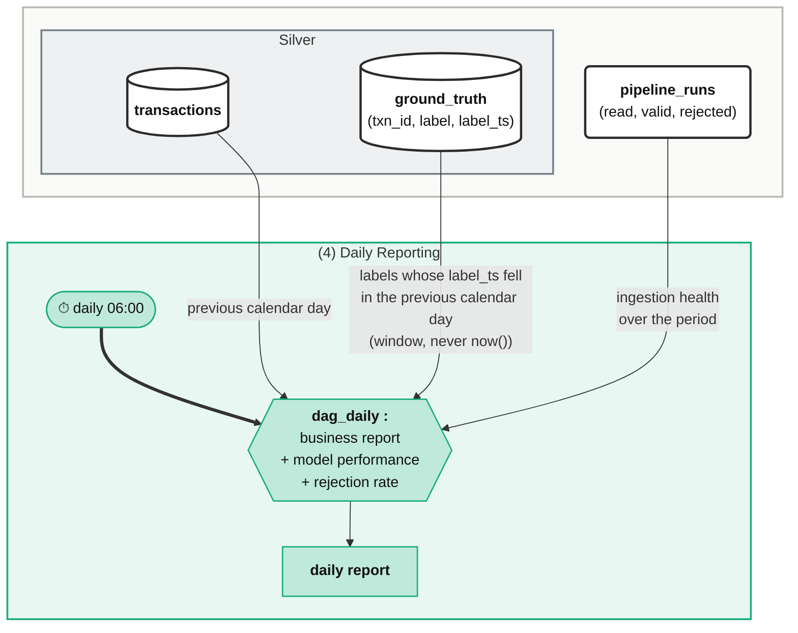

```mermaid
flowchart TB	
	subgraph G2["(4) Daily Reporting"]
		direction TB
		G2_T0(["⏱ daily 06:00"])
		G2_DAY{{"<b>dag_daily :</b><br/>business report<br/>+ model performance<br/>+ rejection rate"}}
		G2_RPT["<b>daily report</b>"]
	end
	
	subgraph DL[" "]
		subgraph SILVER["Silver"]
			DL_TXN[("<b>transactions</b>")]
			DL_GTS[("<b>ground_truth</b><br/>(txn_id, label, label_ts)")]
		end
		
		DL_RUNS("<b>pipeline_runs</b><br/>(read, valid, rejected)")
	end
	
    %% ---
    
	DL ~~~ G2
	
    %% ---------- Control flow ----------
    G2_T0 ==> G2_DAY
	
    %% ---------- Data flow ----------
    DL_TXN  -->|"previous calendar day"| G2_DAY
    DL_GTS  -->|"labels whose label_ts fell<br/>in the previous calendar day<br/>(window, never now())"| G2_DAY
    G2_DAY  --> G2_RPT
    DL_RUNS -->|"ingestion health<br/>over the period"| G2_DAY
    
    %% ---------- Group colours (pale wash) ----------
    style DL     fill:#fafaf9,stroke:#b9b9b2,stroke-width:2px
    style G2     fill:#e8f7f2,stroke:#1baf7a,stroke-width:2px
    %% data layers : deliberately neutral, warm vs cool
    style SILVER fill:#eef0f2,stroke:#78808a,stroke-width:2px
    %% ---------- Nodes : same hue, more intense ----------
    classDef nG2  fill:#bfe9da,stroke:#1baf7a,stroke-width:1.5px,color:#111111
    class T1,API,POL,INGF,INGP,CHK,NOTIF,OPS nG1
    class G2_T0,G2_DAY,PRG,G2_RPT nG2

    %% ---------- Shared stores : white, overriding the group colour ----------
    %% written and/or read by more than one pipeline
    classDef shared fill:#ffffff,stroke:#2b2b2b,stroke-width:2.5px,color:#111111
    class DL_RAW,DL_QRT,DL_GTS,DL_TXN,DL_RUNS,DL_OPS shared
    %% cross-cutting policy, read by two pipelines
    classDef nPURGE fill:#e8e8e5,stroke:#8d8d86,stroke-width:1.5px,color:#111111
    class T4,PRG nPURGE
```