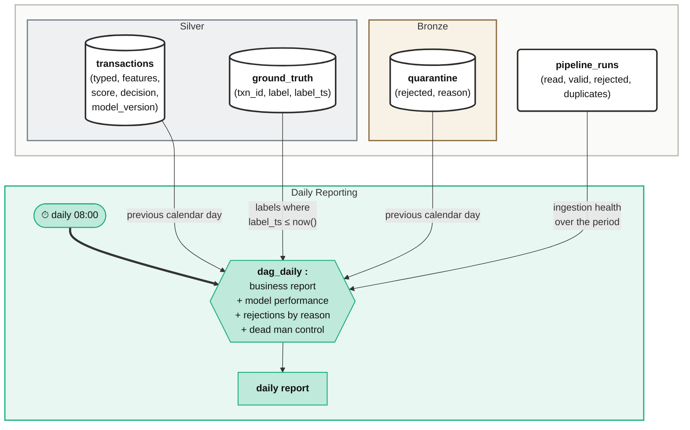

```mermaid
flowchart TB
	subgraph DL[" "]
		subgraph BRONZE["Bronze"]
			QRT[("<b>quarantine</b><br/>(rejected, reason)")]
		end
		subgraph SILVER["Silver"]
			TXN[("<b>transactions</b><br/>(typed, features,<br/>score, decision,<br/>model_version)")]
			GTS[("<b>ground_truth</b><br/>(txn_id, label, label_ts)")]
		end
		
		RUNS("<b>pipeline_runs</b><br/>(read, valid, rejected, duplicates)")
	end
		
	subgraph G2["Daily Reporting"]
		direction TB
		T2(["⏱ daily 08:00"])
		DAY{{"<b>dag_daily :</b><br/>business report<br/>+ model performance<br/>+ rejections by reason<br/>+ dead man control"}}
		REPORT["<b>daily report</b>"]
	end
	
    %% ---
    
	DL ~~~ G2
	
    %% ---------- Control flow ----------
    T2 ==> DAY
	
    %% ---------- Data flow ----------
    TXN  -->|"previous calendar day"| DAY
    GTS  -->|"labels where<br/>label_ts &le; now()"| DAY
    DAY  --> REPORT
    QRT  -->|"previous calendar day"| DAY
    RUNS -->|"ingestion health<br/>over the period"| DAY
    
    %% ---------- Group colours (pale wash) ----------
    style DL     fill:#fafaf9,stroke:#b9b9b2,stroke-width:2px
    style G2     fill:#e8f7f2,stroke:#1baf7a,stroke-width:2px
    %% data layers : deliberately neutral, warm vs cool
    style BRONZE fill:#f7f1e6,stroke:#8a6a3c,stroke-width:2px
    style SILVER fill:#eef0f2,stroke:#78808a,stroke-width:2px
    %% ---------- Nodes : same hue, more intense ----------
    classDef nG2  fill:#bfe9da,stroke:#1baf7a,stroke-width:1.5px,color:#111111
    class T1,API,POL,INGF,INGP,CHK,NOTIF,OPS nG1
    %% simulation scaffolding : dashed border, absent from a real deployment
    classDef demo fill:#ffffff,stroke:#8a6a3c,stroke-width:1.5px,stroke-dasharray:4 3,color:#333333
    class DLY demo
    class T2,DAY,PRG,REPORT nG2

    %% ---------- Shared stores : white, overriding the group colour ----------
    %% written and/or read by more than one pipeline
    classDef shared fill:#ffffff,stroke:#2b2b2b,stroke-width:2.5px,color:#111111
    class RAW,QRT,GTS,TXN,RUNS,GOV shared
    %% cross-cutting policy, read by two pipelines
    classDef nPURGE fill:#e8e8e5,stroke:#8d8d86,stroke-width:1.5px,color:#111111
    class T4,PRG nPURGE
```