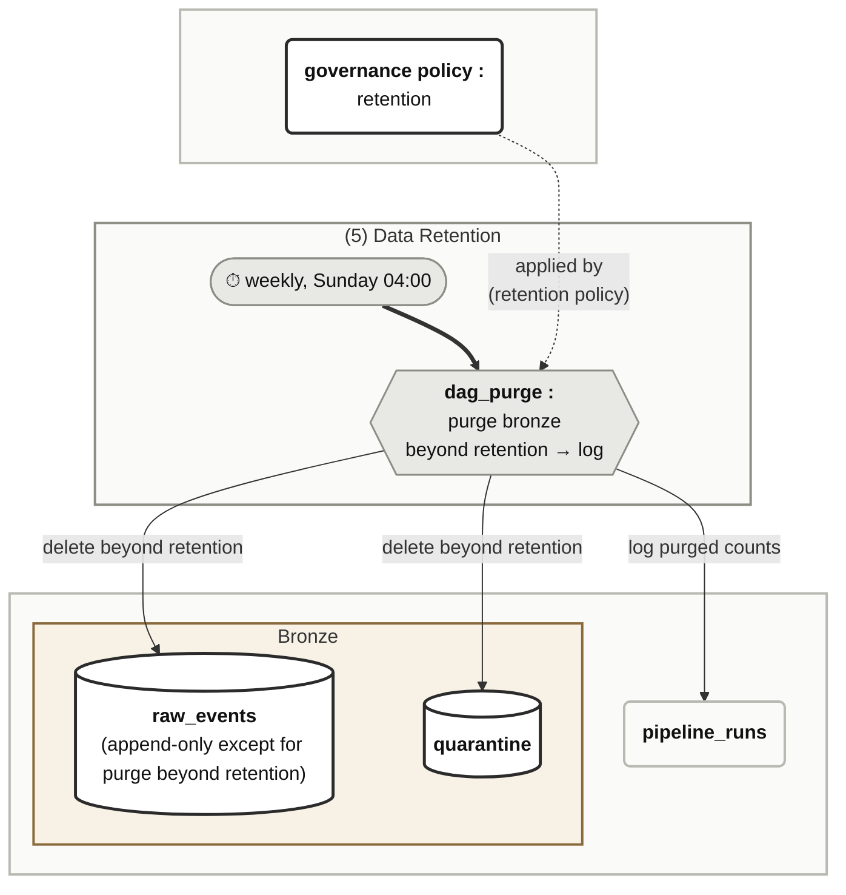

```mermaid
flowchart 
	subgraph RTN["(5) Data Retention"]
		RTN_T0(["⏱ weekly, Sunday 04:00"])
		RTN_PRG{{"<b>dag_purge :&nbsp;&nbsp;</b><br/>purge bronze<br/>beyond retention &rarr; log"}}
	end
	
	subgraph DL[" "]
		subgraph DL_BRONZE["Bronze"]
			DL_RAW[("<b>raw_events</b><br/>(append-only except for purge beyond retention)")]
			DL_QRT[("<b>quarantine</b>")]
		end
		DL_RUNS("<b>pipeline_runs</b>")  
	end
	
	subgraph GP[" "]
		GP_RTN("<b>governance policy :</b><br/>retention")
	end
	
    %% ---
    
    GP ~~~ RTN ~~~ DL
    
    %% ---------- Control flow ----------
    RTN_T0 ==> RTN_PRG
	
    %% ---------- Data flow ----------
    RTN_PRG -->|"delete beyond retention"| DL_RAW 
    RTN_PRG -->|"delete beyond retention"| DL_QRT 
    RTN_PRG -->|"log purged counts"| DL_RUNS
    
    %% ---------- Dependencies ----------
    GP_RTN -.->|"applied by<br/>(retention policy)"| RTN_PRG
    
    %% ---------- Group colours (pale wash) ----------
    %% data layers : deliberately neutral, warm vs cool
    style GP     fill:#fafaf9,stroke:#b9b9b2,stroke-width:2px
    style DL     fill:#fafaf9,stroke:#b9b9b2,stroke-width:2px
    style DL_RUNS fill:#fafaf9,stroke:#b9b9b2,stroke-width:2px
    style DL_BRONZE fill:#f7f1e6,stroke:#8a6a3c,stroke-width:2px
    %% housekeeping : not a transaction pipeline, hence neutral
    style RTN  fill:#fafaf9,stroke:#8d8d86,stroke-width:2px

    %% ---------- Shared stores : white, overriding the group colour ----------
    %% written and/or read by more than one pipeline
    classDef shared fill:#ffffff,stroke:#2b2b2b,stroke-width:2.5px,color:#111111
    class DL_RAW,DL_QRT,DL_GTS,DL_TXN,DL_RUNS,GP_RTN shared
    %% cross-cutting policy, read by two pipelines
    classDef nRTN fill:#e8e8e5,stroke:#8d8d86,stroke-width:1.5px,color:#111111
    class RTN_T0,RTN_PRG nRTN
```