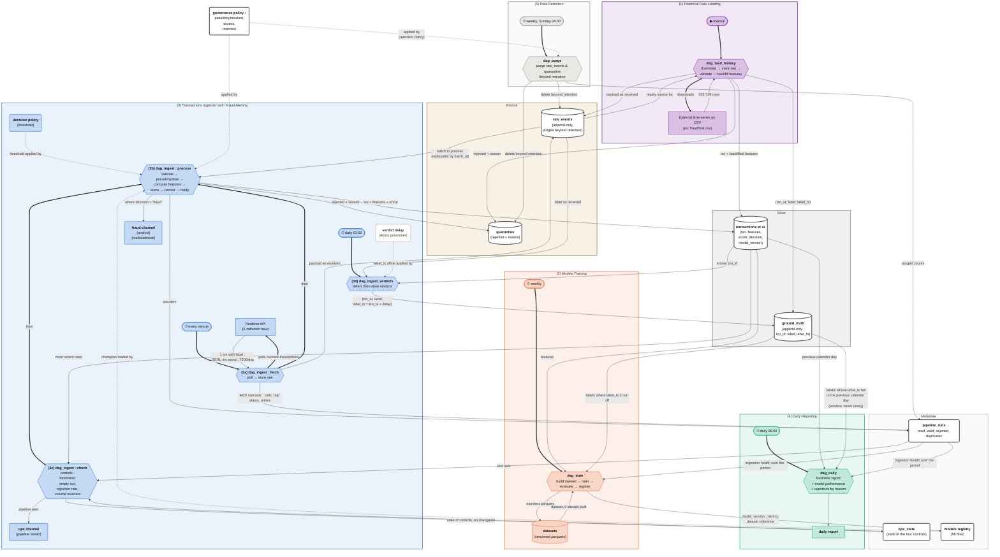

```mermaid
flowchart
	subgraph HDL["(1) Historical Data Loading"]
		T0(["▶ manual"])
		CSV["External time-series as CSV<br/>(ex: fraudTest.csv)"]
		LOAD{{"<b>dag_load_history</b><br/>download &rarr; store raw &rarr; <br/>validate &rarr; backfill features"}}		    
	end		
	
	subgraph G1["(3) Transactions Ingestion with Fraud Alerting"]
		API["Realtime API<br/>(5 calls/min max)"]
		T1(["⏱ every minute"])
		TV(["⏱ daily 02:00"])
		DLY("<b>verdict delay</b><br/>(demo parameter)")
		POL("<b>decision policy</b><br/>(threshold)")
		ING_FCH{{"<b>(3a) dag_ingest : fetch</b><br/>poll &rarr; store raw"}}
		ING_PRC{{"<b>(3b) dag_ingest : process</b><br/>validate &rarr;<br/>pseudonymise &rarr;<br/>compute features &rarr;<br/>score &rarr; persist &rarr; notify"}}
		ING_CHK{{"<b>(3c) dag_ingest : check</b><br/>controls :<br/>freshness,<br/>empty run,<br/>rejection rate,<br/>volume invariant"}}
		WVD{{"<b>(3d) dag_ingest_verdicts</b><br/>defers then store verdicts"}}
		NOTIF["<b>fraud channel</b><br/>(analyst)<br/>(<i>mail/webhook</i>)"]
	    OPS["<b>ops channel</b><br/>(pipeline owner)"]
	end    
	    
	subgraph BRONZE["Bronze"]
		RAW[("<b>raw_events</b><br/>(append-only,<br/>purged beyond retention)")]
		QRT[("<b>quarantine</b><br/>(rejected + reason)")]
	end
	
	subgraph SILVER["Silver"]
		TXN[("<b>transactions et al.</b><br/>(txn, features,<br/>score, decision,<br/>model_version)")]
		GTS[("<b>ground_truth</b><br/>(append-only :<br/>txn_id, label, label_ts)")]
	end
	
	subgraph META["Metadata"]
		RUNS("<b>pipeline_runs</b><br/>read, valid, rejected, duplicates")
		OPS_ST("<b>ops_state</b><br/>(state of the four controls)")
		MDR("<b>models registry</b><br/>(<i>MLflow</i>)")   
	end
	
	subgraph MT["(2) Models Training"]
		T3(["⏱ weekly"])
		TDS[("<b>datasets</b><br/>(<i>versioned parquets</i>)")]
		TRN{{"<b>dag_train</b><br/>build dataset &rarr; train &rarr; evaluate &rarr; register"}}  
	end

	subgraph G2["(4) Daily Reporting"]
		T2(["⏱ daily 06:00"])
		DAY{{"<b>dag_daily</b><br/>business report<br/>+ model performance<br/>+ rejections by reason"}}
		REPORT["<b>daily report</b>"]
	end
	
	subgraph PURGE["(5) Data Retention"]
		T4(["⏱ weekly, Sunday 04:00"])
		PRG{{"<b>dag_purge</b><br/>purge raw_events & quarantine<br/>beyond retention"}}
	end
	
	GP("<b>governance policy :</b><br/>pseudonymisation,<br/>access,<br/>retention")

    HDL ~~~ BRONZE
    HDL ~~~ SILVER
    BRONZE ~~~ SILVER
    SILVER ~~~ MT
    SILVER ~~~ G2
    SILVER ~~~ G1
    MT ~~~ G1
    
    %% ---------- Control flow ----------
    T0 ==> LOAD
    T1 ==> ING_FCH
    TV ==> WVD
    T2 ==> DAY
    T3 ==> TRN
    T4 ==> PRG
    LOAD ==>|"downloads"| CSV
    ING_FCH ==>|"polls /current-transactions"| API
	ING_FCH ==>|"then"| ING_PRC
	ING_PRC ==>|"then"| ING_CHK
	
    %% ---------- Data flow ----------
    CSV  -->|"555 719 rows"| LOAD
    API  -->|"1 txn with label :<br/>JSON, ms epoch, 7200/day"| ING_FCH
    ING_FCH -->|"payload as received"| RAW
    RAW  -->|"batch to process<br/>(replayable by batch_id)"| ING_PRC
    RAW  -->|"replay source for"| LOAD
    LOAD -->|"payload as received"| RAW
    ING_PRC -->|"rejected + reason"| QRT
    LOAD -->|"rejected + reason"| QRT
    ING_PRC -->|"txn + features + score"| TXN
    LOAD -->|"txn + backfilled features"| TXN
    RAW  -->|"label as received"| WVD
    TXN  -->|"known txn_id"| WVD
    WVD  -->|"(txn_id, label,<br/>label_ts = txn_ts + delay)"| GTS
    LOAD -->|"(txn_id, label, label_ts)"| GTS
    ING_PRC -->|"where decision = 'fraud'"| NOTIF
    ING_PRC -->|"counters"| RUNS
    RUNS -->|"last runs"| ING_CHK
    TXN  -->|"previous calendar day"| DAY
    TXN  -->|"most recent rows"| ING_CHK
    GTS  -->|"labels whose label_ts fell<br/>in the previous calendar day<br/>(window, never now())"| DAY
    DAY  --> REPORT
    TXN  -->|"features"| TRN
    GTS  -->|"labels where label_ts &le; cut-off"| TRN
    TRN  -->|"train/test parquets"| TDS
    TRN  -->|"model, version, metrics,<br/>dataset reference"| MDR
    ING_CHK  -->|"pipeline alert"| OPS
    OPS_ST  -->|"previous state"| ING_CHK
    ING_CHK  -->|"state of controls, on change"| OPS_ST
    TDS -->|dataset, if already built| TRN
    ING_FCH -->|"fetch outcome : calls, http status, retries"| RUNS
    RUNS -->|"ingestion health over the period"| TRN 
    RUNS -->|"ingestion health over the period"| DAY
    PRG -->|"delete beyond retention"| RAW 
    PRG -->|"delete beyond retention"| QRT 
    PRG -->|"purged counts"| RUNS
    
    %% ---------- Dependencies ----------
    MDR -.->|"champion loaded by"| ING_PRC
    POL -.->|"threshold applied by"| ING_PRC
    DLY -.->|"label_ts offset applied by"| WVD
    GP -.->|"applied by"| ING_PRC
    GP -.->|"applied by<br/>(retention policy)"| PRG
    
    %% ---------- Group colours (pale wash) ----------
    style HDL    fill:#f2e9f6,stroke:#7b1fa2,stroke-width:2px
    style MT     fill:#fdf0eb,stroke:#eb6834,stroke-width:2px
    style G1     fill:#eaf2fb,stroke:#2a78d6,stroke-width:2px
    style G2     fill:#e8f7f2,stroke:#1baf7a,stroke-width:2px
    %% data layers : deliberately neutral, warm vs cool
    style BRONZE fill:#f7f1e6,stroke:#8a6a3c,stroke-width:2px
    style SILVER fill:#eef0f2,stroke:#78808a,stroke-width:2px
    style META   fill:#fafaf9,stroke:#b9b9b2,stroke-width:2px
    %% housekeeping : not a transaction pipeline, hence neutral
    style PURGE  fill:#fafaf9,stroke:#8d8d86,stroke-width:2px

    %% ---------- Nodes : same hue, more intense ----------
    classDef nHDL fill:#dac0e5,stroke:#7b1fa2,stroke-width:1.5px,color:#111111
    classDef nMT  fill:#f9d5c6,stroke:#eb6834,stroke-width:1.5px,color:#111111
    classDef nG1  fill:#c3d9f4,stroke:#2a78d6,stroke-width:1.5px,color:#111111
    classDef nG2  fill:#bfe9da,stroke:#1baf7a,stroke-width:1.5px,color:#111111
    class T0,CSV,LOAD nHDL
    class T1,TV,API,POL,ING_FCH,ING_PRC,ING_CHK,WVD,NOTIF,OPS nG1
    %% simulation scaffolding : dashed border, absent from a real deployment
    classDef demo fill:#ffffff,stroke:#8a6a3c,stroke-width:1.5px,stroke-dasharray:4 3,color:#333333
    class DLY demo
    class T3,TRN,TDS nMT
    class T2,DAY,REPORT nG2

    %% ---------- Shared stores : white, overriding the group colour ----------
    %% written and/or read by more than one pipeline
    classDef shared fill:#ffffff,stroke:#2b2b2b,stroke-width:2.5px,color:#111111
    class RAW,QRT,GTS,TXN,RUNS,OPS_ST,MDR,GP shared
    %% cross-cutting policy, read by two pipelines
    classDef nPURGE fill:#e8e8e5,stroke:#8d8d86,stroke-width:1.5px,color:#111111
    class T4,PRG nPURGE
```
