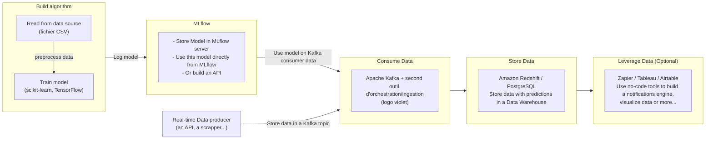

```mermaid
flowchart LR
    subgraph BA["Build algorithm"]
        direction TB
        CSV["Read from data source<br/>(fichier CSV)"] -->|preprocess data| TM["Train model<br/>(scikit-learn, TensorFlow)"]
    end

    subgraph ML["MLflow"]
        direction TB
        MLF["- Store Model in MLflow server<br/>- Use this model directly from MLflow<br/>- Or build an API"]
    end

    subgraph CD["Consume Data"]
        direction TB
        KA["Apache Kafka + second outil d'orchestration/ingestion<br/>(logo violet)"]
    end

    subgraph SD["Store Data"]
        direction TB
        DW["Amazon Redshift / PostgreSQL<br/>Store data with predictions in a Data Warehouse"]
    end

    subgraph LD["Leverage Data (Optional)"]
        direction TB
        NC["Zapier / Tableau / Airtable<br/>Use no-code tools to build a notifications engine,<br/>visualize data or more..."]
    end

    RT["Real-time Data producer<br/>(an API, a scrapper...)"]

    BA -->|Log model| ML
    ML -->|"Use model on Kafka consumer data"| CD
    RT -->|"Store data in a Kafka topic"| CD
    CD --> SD
    SD --> LD
```