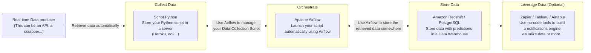

```mermaid
flowchart LR
    RT["Real-time Data producer<br/>(This can be an API, a scrapper...)"]

    subgraph CD["Collect Data"]
        PY["Script Python<br/>Store your Python script in a server<br/>(Heroku, ec2...)"]
    end

    subgraph OR["Orchestrate"]
        AF["Apache Airflow<br/>Launch your script automatically using Airflow"]
    end

    subgraph SD["Store Data"]
        DW["Amazon Redshift / PostgreSQL<br/>Store data with predictions in a Data Warehouse"]
    end

    subgraph LD["Leverage Data (Optional)"]
        NC["Zapier / Tableau / Airtable<br/>Use no-code tools to build a notifications engine,<br/>visualize data or more..."]
    end

    RT -->|"Retrieve data automatically"| CD
    CD <-->|"Use Airflow to manage your Data Collection Script"| OR
    OR <-->|"Use Airflow to store the retrieved data somewhere"| SD
    SD --> LD
```